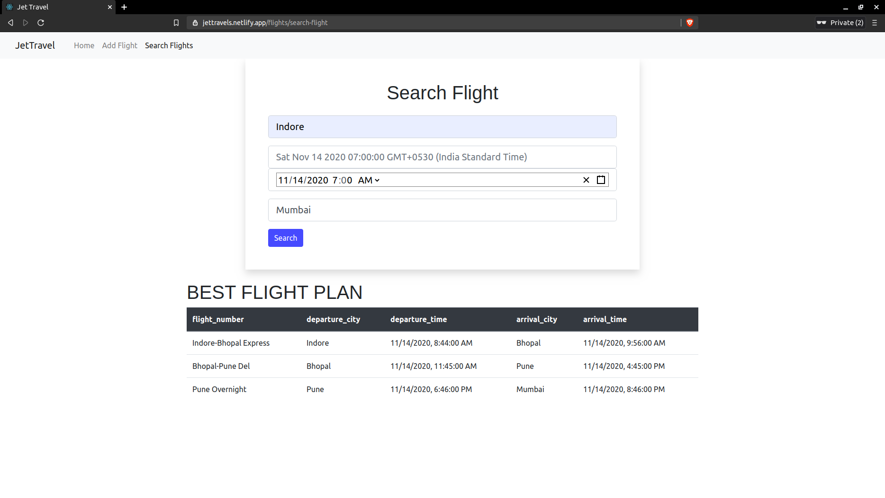

# Jet Travel : Flight Search App

## Objective of Project 

• Develop a flight search app that finds best the possible flight between two destinations. 
• Create a table for storing all the flight related information like the flight number,departure and arrival cities and the corresponding departure and arrival       times.  
• Create an API for inserting new flight information  
• Create an API for Delete flight information  

### Technologies
Frontend :- Reactjs
Backend  :- Django

### Deployment :-
      Frontend on Netlify
      Backend  on Heroku 

### Setup the Project locally :-  
  ***Backend*** :-
   1. Clone the repo
         git clone https://github.com/TejsinghDhaosriya/Flight-Search-App
   2. Inside the Base Directory(inside the root of project) run pip install so that all dependencies of project get install 
         pip install -r requirements.txt
   3. Start the Backend
         python manaage.py runserver
   Note :- Backend is by default served at 8000 if due to some reason it is not able to serve at 8000 ,if it is serve at any other port then change the port number in baseURL.js file which is inside at flight-frontend folder.      
  ***Frontend***:-
  1. Move to flight-frontend folder
       cd flight-frontend
  2. Installing the dependencies 
       yarn install
  3.  Starting the frontend
       yarn start
       will serve project at port 3000
       
### Inside the Project :- 
   Project purpose is to find the shortest route it is implement by Dijkstra shortest path algorithm with some modifications .
   

#### Pls visit to above link for demo
[Link to Video!](https://www.youtube.com/watch?v=dNYf_nQgzEc)

##Project Link :-
    [Link to Project!](https://jettravels.netlify.app)
# excel-to-json
